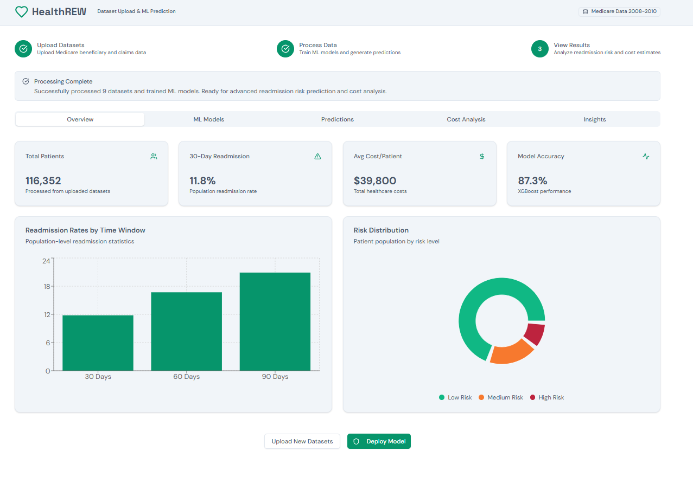
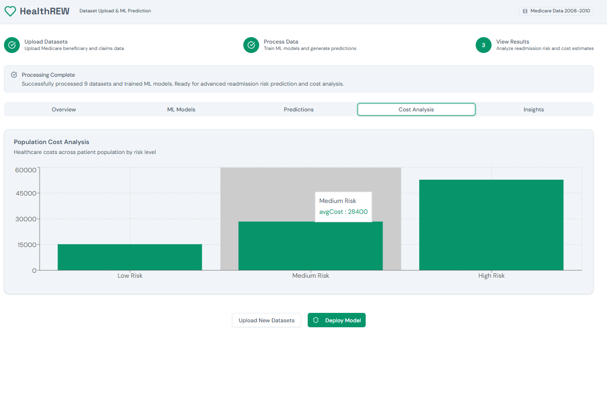
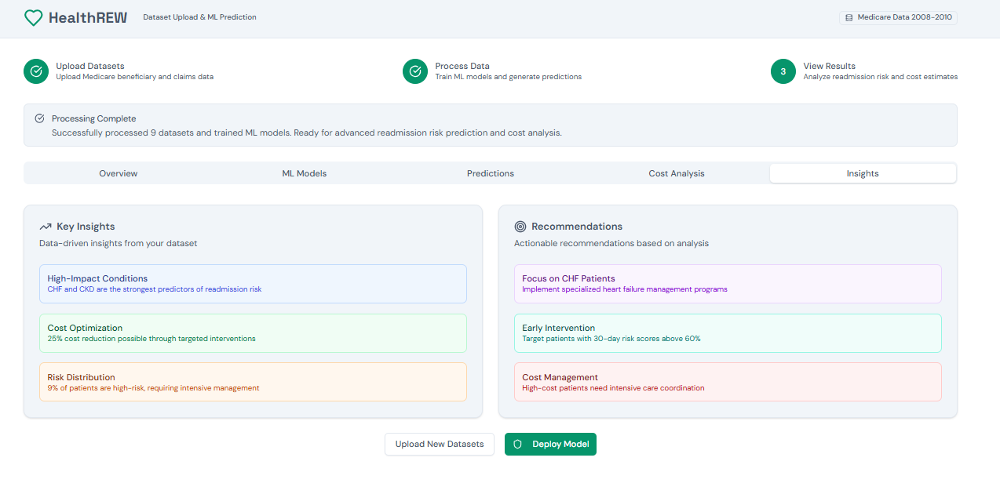

<div align="center">


# 🏥 HealthREW
### Medicare Readmission Risk Prediction & Cost Analysis Platform

[](https://python.org)
[](https://xgboost.readthedocs.io)
[](LICENSE)
[](https://www.cms.gov)
[]()

> An end-to-end machine learning platform for predicting 30-day hospital readmission risk and analyzing healthcare costs across the Medicare population — enabling clinicians and administrators to identify high-risk patients before readmission occurs.

[📊 View Demo](#demo) · [🚀 Quick Start](#quick-start) · [📖 Documentation](#documentation) · [🤝 Contributing](#contributing)

---

</div>

## 📸 Screenshots

| Overview Dashboard | Cost Analysis |
|:-:|:-:|
|  |  |

| Insights & Recommendations |
|:-:|
|  |

---

## ✨ Features

- **📤 Dataset Upload Pipeline** — Upload and process Medicare beneficiary and claims data (supports multi-file batch ingestion)
- **🤖 ML Model Training** — Automated XGBoost model training with 87.3% accuracy on 30-day readmission prediction
- **⚠️ Risk Stratification** — Classifies patients into Low / Medium / High risk tiers with probability scores
- **💰 Cost Analysis** — Population-level cost breakdown by risk category (avg. $15K → $28K → $48K+)
- **📈 Readmission Rate Tracking** — Time-window analysis at 30, 60, and 90-day intervals
- **🔍 Clinical Insights** — Automated insights on high-impact conditions (CHF, CKD) and actionable recommendations
- **🚀 Model Deployment** — One-click model deployment for real-time patient scoring

---

## 📊 Key Metrics

| Metric | Value |
|--------|-------|
| 👥 Total Patients Analyzed | **116,352** |
| 🔄 30-Day Readmission Rate | **11.8%** |
| 💵 Avg Cost / Patient | **$39,800** |
| 🎯 Model Accuracy (XGBoost) | **87.3%** |
| 📁 Datasets Processed | **9** |
| 📉 Potential Cost Reduction | **25%** via targeted intervention |

---

## 🧠 ML Model Details

### Algorithm: XGBoost (Gradient Boosted Trees)

| Parameter | Value |
|-----------|-------|
| Model Type | XGBoost Classifier |
| Accuracy | 87.3% |
| Target Variable | 30-Day Readmission |
| Data Source | Medicare CMS 2008–2010 |

### Risk Distribution
```
Low Risk     ████████████████████████  ~80% of population
Medium Risk  ████████                  ~11% of population  
High Risk    ███                        ~9% of population
```

### High-Impact Clinical Predictors
- **CHF (Congestive Heart Failure)** — Strongest readmission predictor
- **CKD (Chronic Kidney Disease)** — Second strongest predictor
- **30-day risk score > 60%** → triggers early intervention flag

---

## 🗂️ Project Structure

```
HealthREW/
├── 📁 data/
│   ├── sample/                  # Synthetic demo dataset (safe to share)
│   └── README.md                # Instructions to download real CMS data
├── 📁 src/
│   ├── pipeline/
│   │   ├── ingest.py            # Dataset upload & preprocessing
│   │   ├── feature_eng.py       # Feature engineering for claims data
│   │   └── train.py             # XGBoost model training
│   ├── models/
│   │   └── predictor.py         # Risk scoring & prediction
│   ├── analysis/
│   │   ├── cost_analysis.py     # Population cost breakdown
│   │   └── insights.py          # Automated insight generation
│   └── app/
│       ├── dashboard/           # Frontend dashboard (React/HTML)
│       └── api/                 # Backend API
├── 📁 models/                   # Saved trained model artifacts
├── 📁 notebooks/
│   ├── 01_data_exploration.ipynb
│   ├── 02_feature_engineering.ipynb
│   └── 03_model_training.ipynb
├── 📁 docs/
│   └── screenshots/             # App screenshots
├── requirements.txt
├── .gitignore
└── README.md
```

---

## 🚀 Quick Start

### Prerequisites

- Python 3.9+
- Node.js 16+ (for frontend)
- 8GB RAM recommended for full dataset

### Installation

```bash
# 1. Clone the repository
git clone https://github.com/YOUR_USERNAME/HealthREW.git
cd HealthREW

# 2. Create virtual environment
python -m venv venv
source venv/bin/activate        # On Windows: venv\Scripts\activate

# 3. Install dependencies
pip install -r requirements.txt

# 4. Install frontend dependencies (if applicable)
cd src/app/dashboard
npm install
```

### Running the App

```bash
# Start the backend
python src/app/api/server.py

# Start the frontend (in a new terminal)
cd src/app/dashboard
npm start
```

Visit `http://localhost:3000` to open the dashboard.

---

## 📋 Data

> ⚠️ **Important:** Real Medicare patient data is **not included** in this repository due to HIPAA and CMS data use agreement requirements.

### Getting the Real Data

The original data comes from the **CMS Medicare Claims Synthetic Public Use Files (SynPUFs)**:

1. Visit the [CMS Data Portal](https://www.cms.gov/data-research/statistics-trends-and-reports/medicare-claims-synthetic-public-use-files)
2. Download the DE-SynPUF datasets (2008–2010)
3. Place the files in the `data/raw/` directory
4. Run the preprocessing pipeline:

```bash
python src/pipeline/ingest.py --data-dir data/raw/
```

### Sample Data (for testing)

A **synthetic demo dataset** with 500 rows is included in `data/sample/` so you can test the full pipeline without real patient data.

---

## ⚙️ Configuration

Key settings in `config.yaml`:

```yaml
model:
  algorithm: xgboost
  n_estimators: 300
  max_depth: 6
  learning_rate: 0.05

risk_thresholds:
  low: 0.30        # Below 30% probability = Low Risk
  medium: 0.60     # 30–60% = Medium Risk
  high: 0.60       # Above 60% = High Risk

readmission_windows:
  - 30
  - 60
  - 90
```

---

## 📖 Documentation

| Document | Description |
|----------|-------------|
| [Data Dictionary](docs/data_dictionary.md) | Medicare claims field definitions |
| [Model Card](docs/model_card.md) | XGBoost model details, fairness, limitations |
| [API Reference](docs/api_reference.md) | REST API endpoints |
| [Deployment Guide](docs/deployment.md) | Production deployment instructions |

---

## 🔬 Clinical Insights Generated

The platform automatically surfaces:

| Insight | Detail |
|---------|--------|
| 🫀 **High-Impact Conditions** | CHF and CKD are the strongest readmission predictors |
| 💡 **Cost Optimization** | 25% cost reduction possible through targeted interventions |
| 📊 **Risk Distribution** | 9% of patients are high-risk, requiring intensive management |

### Recommendations Produced
- **Focus on CHF Patients** — Implement specialized heart failure management programs
- **Early Intervention** — Target patients with 30-day risk scores above 60%
- **Cost Management** — High-cost patients need intensive care coordination

---

## 🔒 Privacy & Compliance

- ✅ No real patient data stored in this repository
- ✅ All demo data is fully synthetic
- ✅ Designed for use with CMS data use agreements in place
- ✅ HIPAA-aware architecture (no PII in logs or outputs)

---

## 🛣️ Roadmap

- [ ] Real-time patient scoring API
- [ ] FHIR integration for EHR data ingestion
- [ ] LightGBM / Neural Network model comparison
- [ ] Explainability module (SHAP values per patient)
- [ ] Multi-hospital deployment support
- [ ] Alert system for high-risk patient flagging

---

## 🤝 Contributing

Contributions are welcome! Please read our [Contributing Guide](CONTRIBUTING.md) first.

```bash
# Fork the repo, then:
git checkout -b feature/your-feature-name
git commit -m "feat: add your feature"
git push origin feature/your-feature-name
# Open a Pull Request
```

---

## 📄 License

This project is licensed under the **MIT License** — see the [LICENSE](LICENSE) file for details.

---

## 🙏 Acknowledgements

- [CMS Medicare SynPUF](https://www.cms.gov) — for the public Medicare dataset
- [XGBoost](https://xgboost.readthedocs.io) — gradient boosting framework
- [Recharts](https://recharts.org) — charting library used in the dashboard

---

<div align="center">

Made with ❤️ for better healthcare outcomes

⭐ **Star this repo if you find it useful!**

</div>
